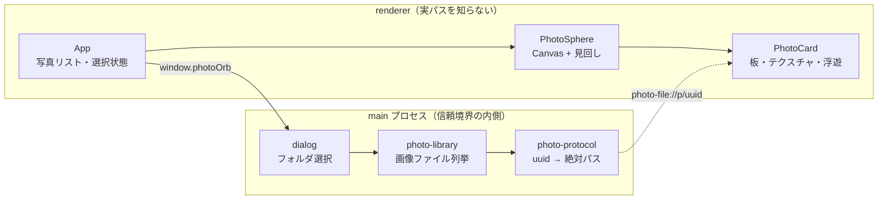

# photo-orb 開発計画

3D 空間に写真を浮かべ、見回して 1 枚を選ぶプレビューアプリ。

技術調査は `research/260730-3d-photo-preview.md` にある。設計判断の根拠はそこを見ること。

## 全体像

## マイルストーン

| # | 内容 | 状態 |
|---|---|---|
| M1 | フォルダ選択 → 写真を球殻に配置 → 見回し → ホバー強調 → クリックで手前に拡大 | 進行中 |
| M2 | サムネイル生成（sharp）で大量枚数に耐える。読み込みプログレス | 未着手 |
| M3 | 空間の演出強化（背景・被写界深度・写真の反射、テーマ切替） | 未着手 |
| M4 | EXIF 表示、撮影日時を奥行き軸に使う「時間の空間」モード | 未着手 |
| M5 | キーボード操作（矢印で隣の写真へ）とアクセシビリティ | 未着手 |

## M1 の作業分解

1. Electron + electron-vite + React 19 + R3F の骨格を立てる
2. `photo-file://` プロトコル（トークン方式）で画像を配信する
3. `photo-library.js` でフォルダ内の画像を列挙する（拡張子ホワイトリスト、上限 60 枚）
4. `sphere-layout.js` で Fibonacci sphere の座標を計算する（純関数 + テスト）
5. `PhotoCard` — 板にテクスチャ、sin 波で浮遊、ホバーで拡大＋発光
6. `PhotoSphere` — Canvas、OrbitControls、選択時はコントロール無効化
7. 選択されたカードをカメラ前方へ lerp 移動（Esc / 再クリックで復帰）

## 設計上の約束（崩さないこと）

- **renderer は絶対パスを受け取らない**。受け取るのは `photo-file://p/<uuid>` だけ。
  これがパストラバーサル防止の根拠なので、デバッグ目的でもパスを渡さない。
- **座標計算・ファイル列挙は純関数に切り出す**。3D シーンの中に計算を埋め込むと
  テストできなくなり、配置の調整が「動かして目で見る」しかできなくなる。
- **`nodeIntegration: false` / `contextIsolation: true` は変更しない**。
  renderer に必要な機能は preload の `contextBridge` に関数を 1 つ足す形で増やす。
